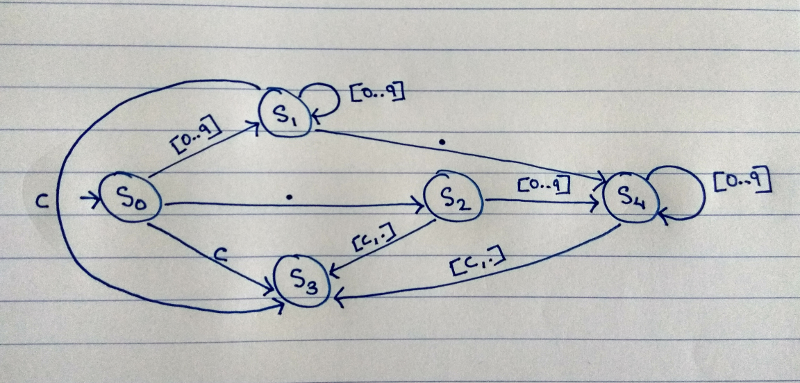

# literal-classifier

The objective is to create a deterministic finite automaton for classifying literals.

The project is written in Scala and the state machine is designed using vanilla Akka actors (ps. this demonstration does not use the FSM constructs provided by Akka).

For this demo a literal can be integer, float or string. Handling of leading positive and negative signs before numeric literals have been omited to maintain the brevity and simplicity of the demonstration. So +12 and -12.34 will be classified as string.

## Alphabet

Let `U` be the set of all characters. Let `C` be `U - {0..9} - {\.}`.

## States

The machine has five states, S0 through S4. The following table describes each of the states.

| State | Description |
| ------ | ------ |
| S0 | Unknown (initial state) |
| S1 | Integer |
| S2 | Maybe float |
| S3 | String |
| S4 | Float |

## Diagram of the automaton

